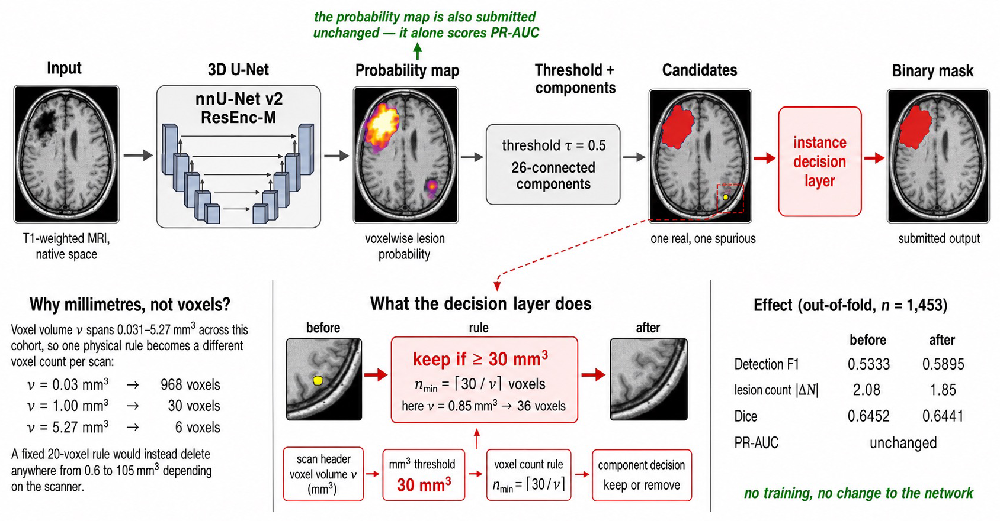
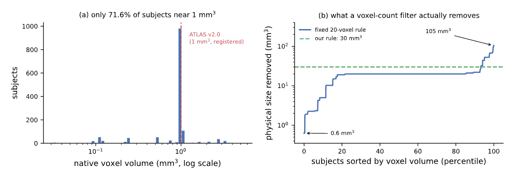

<h1 align="center">
<strong>Voxels or Millimetres? A Controlled Comparison of Lesion-Size Filtering for Native-Space Stroke Segmentation</strong>
</h1>

<div align="center">

<a href="https://git.io/typing-svg">

</a>

[](https://openreview.net/forum?id=RnGE9a4HCq)
[](#-citation)
[](#-what-was-submitted)
[](training/README.md)
[](LICENSE)
[](https://visitorbadge.io/status?path=https%3A%2F%2Fgithub.com%2Fadinathdukre%2Fisles26-voxels-or-millimetres)

**[Govinda Kolli](https://github.com/govindakolli), [Adinath Madhavrao Dukre](https://github.com/adinathdukre), Imran Razzak**


</div>

## 🔥 News
- 🎉 **Accepted** at **ISLES'26 @ MICCAI 2026**. Read the paper on [OpenReview](https://openreview.net/forum?id=RnGE9a4HCq).
- **[27 Aug 2026]** 📄 Paper published on [OpenReview](https://openreview.net/forum?id=RnGE9a4HCq).

## Overview
Code for our **ISLES'26** entry and the MICCAI 2026 SWITCH+ workshop paper. **What helped was not the network.** It was writing the small-component filter in **mm³ instead of voxels** and fitting it to the challenge's rank-based objective on pooled out-of-fold predictions. Larger planners, a transformer backbone, four new losses, six augmentation regimes and metadata conditioning all failed or stayed inside the seed-noise floor.

> [!IMPORTANT]
> This repository is **code only**: no manuscript, imaging data, checkpoints or per-subject results. The scripts behind every number are in [`analysis/`](analysis/).

<p align="center">

<br/>
<em><b>Fig. 1.</b> Overview of the instance decision layer. The nnU-Net probability map is submitted unchanged for PR-AUC and separately thresholded into connected components; components smaller than 30 mm³ are removed using the scan-specific threshold n<sub>min</sub> = ⌈30/ν⌉, where ν is the voxel volume from the image header.</em>
</p>

## 💡 The Finding

ISLES'26 ranks five metrics per case (Dice, |ΔV|, PR-AUC, Detection F1, |ΔN|). Our baseline's Dice (0.645) is near inter-rater agreement (0.76), but Detection F1 (0.533) is not, so the headroom is in **finding** lesions.

ISLES'26 is native space: voxel volume spans **0.031 to 5.27 mm³** (168×), so a 20-voxel rule means 0.63 mm³ on one scanner and 105 mm³ on another. Our decision layer binarises at **τ = 0.5** and drops 26-connected components **< 30 mm³**, using each scan's own voxel size.

<p align="center">

<br/>
<em><b>Fig. 2.</b> Why the unit matters. (a) Voxel volume ν across the cohort; the dashed line marks the 1 mm³ grid that ATLAS v2.0 guaranteed by registration. (b) A fixed 20-voxel rule expressed as the physical volume it removes, against a fixed 30 mm³ rule (dashed).</em>
</p>

- **Filtering at all:** Detection F1 **0.5333 → 0.5895**, |ΔN| **2.08 → 1.85**, for 0.001 Dice.
- **mm³ vs. voxels:** a smaller **+0.0036** Detection F1 (95% CI [0.0016, 0.0058]), holding on held-out sites in 99.5% of 400 splits.

> [!NOTE]
> Seed-noise floor: Dice 0.0043, Detection F1 0.0057, PR-AUC 0.0034. Nothing smaller counts as a result.

## 📦 What Was Submitted

| Component | Value |
|---|---|
| Model | nnU-Net v2 ResEnc-M, `3d_fullres`, T1w only |
| Ensemble | 500-epoch trainer + Dice+TopK10 (250 ep), folds 0–4, softmax weights 0.65 / 0.35 |
| Checkpoint | `checkpoint_final.pth` |
| Decision layer | τ = 0.5, drop components < 30 mm³; soft map shipped unfiltered |

The whole method is in [`submission/inference.py`](submission/inference.py).

## 🏆 Main Results

Pooled out-of-fold, n = 1,453, scored with the organisers' evaluation code.

<div align="center">

| Configuration | Dice ↑ | Det. F1 ↑ | \|ΔN\| ↓ | \|ΔV\| (mL) ↓ | PR-AUC ↑ |
|---|:---:|:---:|:---:|:---:|:---:|
| 250-ep baseline | 0.6452 | 0.5333 | 2.08 | – | 0.7339 |
| + 30 mm³ decision layer | 0.6441 | 0.5895 | 1.85 | – | 0.7339 |
| 500-ep member + decision layer | **0.6565** | **0.6097** | **1.81** | 5.36 | 0.7528 |
| **Shipped ensemble** (equal weights) | 0.6552 | 0.6063 | 1.82 | **5.25** | **0.7617** |

</div>

## 🧪 What Did Not Work

| Arm | Outcome |
|---|---|
| ResEnc-L | Tie at 250 ep, worse at 500 ep, ~3× the compute |
| Primus (transformer) | Detection F1 0.340 vs. 0.603 |
| Blob, Tversky, focal Tversky, batch Dice | None beat the noise floor |
| Augmentation changes | nnU-Net default was best |
| clDice | +0.0144 Detection F1, but worse on overall rank |
| FiLM metadata conditioning | Null across 5 folds (p = 0.76) |
| Naive / 3-member ensembles, confidence or learned filtering | No gain beyond the floor |

> [!WARNING]
> Pooling all five folds reversed three single-fold conclusions. Two tooling bugs (a no-op clDice loss and a scorer that silently fell back to binary masks) were caught and fixed.

## ⚠️ Caveats
- The preliminary leaderboard uses **two cases**, one of them from the public training set, so it rewards memorisation. Expect **~0.65 Dice** on held-out data.
- Most ablations are **single-fold**; only the decision layer and FiLM were run on all five.
- The filter removes 28.1% of ground-truth lesions (those under 30 mm³).
- The two-member GPU path has not been tested inside the container, and `analysis/sweep_mm3_all5.py` is a reconstruction not yet run end to end.

## ⚡ Quick Start

```bash
git clone https://github.com/adinathdukre/isles26-voxels-or-millimetres.git
cd isles26-voxels-or-millimetres
pip install -r requirements.txt   # pinned versions affect the metrics
source training/env.sh

python3 training/convert_to_nnunet.py
nnUNetv2_plan_and_preprocess -d 1 -pl nnUNetPlannerResEncM -c 3d_fullres
training/train_shipped.sh         # keeps --npz softmax maps

A=nnUNetTrainer_500epochs__nnUNetResEncUNetMPlans__3d_fullres
B=nnUNetTrainerDiceTopK10_250epochs__nnUNetResEncUNetMPlans__3d_fullres
python3 analysis/official_score.py --runs "$A+$B" --folds 0,1,2,3,4 \
        --thresholds 0.5 --min-sizes 0,20,30,40 --mm3 --tag oof
```

You supply the ISLES'26 data (`ISLES_ATLAS3_RAW`) and the organisers' `eval_utils.py` (in `analysis/official/`); neither is redistributed here. Setup, environment variables and per-number commands are in [`training/README.md`](training/README.md) and [`analysis/README.md`](analysis/README.md).

## 📝 Citation

```bibtex
@inproceedings{kolli2026voxels,
  author    = {Kolli, Govinda and Dukre, Adinath Madhavrao and Razzak, Imran},
  title     = {Voxels or Millimetres? A Controlled Comparison of Lesion-Size
               Filtering for Native-Space Stroke Segmentation},
  booktitle = {MICCAI 2026 Workshop on SWITCH+},
  series    = {Lecture Notes in Computer Science},
  publisher = {Springer},
  year      = {2026},
  url       = {https://openreview.net/forum?id=RnGE9a4HCq},
  note      = {To appear; volume and pages not yet assigned}
}
```

## 📚 Acknowledgments
Thanks to the ISLES'26 organisers (challenge, data and [submission template](https://github.com/ezequieldlrosa/isles26-docker-template)), the ATLAS v3.0 contributors, and the [nnU-Net](https://github.com/MIC-DKFZ/nnUNet) and [Panoptica](https://github.com/BrainLesion/panoptica) authors.

## 📨 Contact
Open an [issue](https://github.com/adinathdukre/isles26-voxels-or-millimetres/issues) or contact [Govinda Kolli](https://github.com/govindakolli) and [Adinath Madhavrao Dukre](https://github.com/adinathdukre).

## 📜 License
Apache 2.0 (see [`LICENSE`](LICENSE)). Third-party material, including the LGPL `connected-components-3d` dependency, is listed in [`NOTICE`](NOTICE). The ISLES'26 data and `eval_utils.py` are not covered and not redistributed.

> [!IMPORTANT]
> For research only. Not approved for clinical use.
